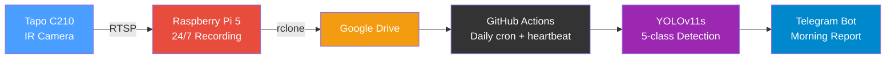
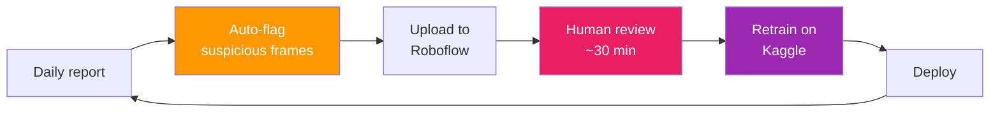
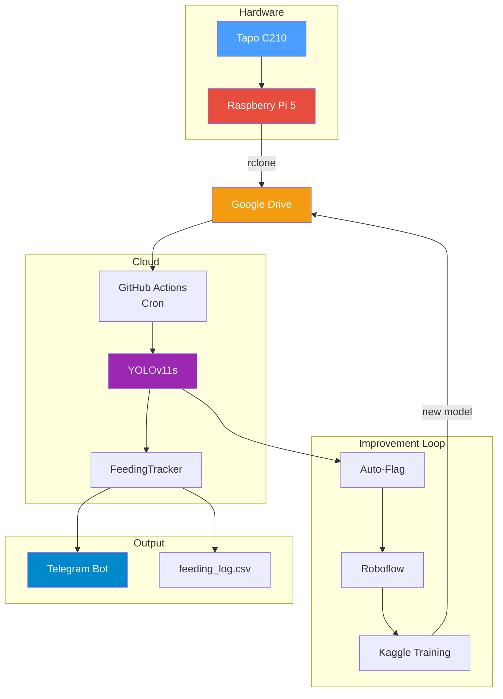

# Fair Feeder

**AI-powered cat feeding monitor** that tracks who eats what, counts kibble, detects hand-feeding, and sends daily Telegram reports — all from a $15 camera.

<!-- PHOTO: annotated video frame showing Dan at bowl with bounding boxes -->

---

## Why

I have two cats: **Dan** (picky eater) and **Sanbo** (food thief). Every morning I hand-feed Dan, but Sanbo steals his food the moment I look away. I needed to know: *did Dan actually eat enough today?*

## Repo Guide

If you're new to the project, read the files in this order:

- `motion_recorder.py`, `morning_report.ipynb`, `flagging.py`, `roboflow_upload.py` — production path (root, hardcoded dependencies)
- `notebooks/fair_feeder_v14.ipynb`, `scripts/train.py`, `scripts/download_dataset.py` — training and dataset work
- `notebooks/smoketest.ipynb`, `notebooks/batch_review.ipynb` — interactive analysis and historical review
- `tests/test_flagging.py`, `tests/test_roboflow_upload.py` — unit tests for production modules

## How It Works



1. **Pi 5** runs 24/7 — detects motion, records clips, uploads to Google Drive
2. **GitHub Actions** picks up clips every morning, runs YOLOv11 inference
3. **FeedingTracker** analyzes detections: who was at the bowl, how long, how many kibble eaten
4. **Telegram bot** sends the report with summary, timeline chart, snapshots, and annotated video

## Detection Classes

| Class | What | Why |
|-------|------|-----|
| **Dan** | Tuxedo cat (dark) | Track feeding time |
| **Sanbo** | Calico cat (orange) | Detect food theft |
| **Dan_hand** | My hand near bowl | Track hand-feeding sessions |
| **Bowl** | Food bowl | Reference point for "at bowl" detection |
| **Kibble** | Individual food pieces | Count consumption |

## Sample Report

```
OK: No extra kibble needed
2026-03-28
06:20:10-06:22:02 (2m 30s)
Start: ~26 kibble
Dan   [########] 100% (~24)
      bowl 1m 46s; first 06:20:15
Sanbo [........] 0% (~0)
      bowl 0m 00s; first unknown
Hand: none
Schedule: cron 0 3 * * *; start 07:16:00 UTC; delay +256m
Why: Dan got the detected kibble share.
Flags: 6 frames -> Roboflow (6 sent); top: blip-kibble 3, low-conf-sanbo 2
```

The first line appears in the Telegram push notification so you can see the verdict without opening the message. When compensation is needed it starts with `ACTION: Give Dan ~N kibble`. Timestamps in the report use seconds because a bowl can be emptied within a minute.

<!-- PHOTO: timeline chart showing kibble count, cat presence over time -->

## Model Performance

Current production baseline is V14, trained on 775 images with [Roboflow](https://roboflow.com) dataset management. V15 has been trained from 155 manually revised April flagged images, but should be validated against V14 with the same fixed validation command before deployment.

| Class | AP50 | Precision | Recall |
|-------|------|-----------|--------|
| Bowl | 0.995 | 0.990 | 1.000 |
| Dan | 0.936 | 0.867 | 0.897 |
| Dan_hand | 0.936 | 1.000 | 0.716 |
| Kibble | 0.931 | 0.949 | 0.872 |
| Sanbo | 0.985 | 0.899 | 1.000 |
| **Overall** | **0.957** | **0.941** | **0.897** |

## Data Flywheel

The model improves itself through automated feedback:



Auto-flagging catches: single-frame hallucinations, contradicting detections, impossible scenarios (hand without cat), kibble count jumps.

Daily flag counts are included in Telegram and logged to `feeding_log.csv` (`flagged_frames`, Roboflow upload/skipped/failed counts, and top flag tags). At retraining time, the monthly trend shows which failure modes are still common.

Model maintenance handbook: [docs/model-improvement-handbook.md](docs/model-improvement-handbook.md)

## 24/7 Camera Position Alert

The Pi recorder monitors whether the bowl stays framed while running 24/7 using the existing `yolov8n.pt` COCO `bowl` class. Keep `yolov8n.pt` available in the recorder working directory on the Pi so the same lightweight model can handle both cat filtering and bowl-position checks.

Default behavior: check every 30 seconds; send Telegram if the bowl is missing or outside the center area for 10 continuous minutes; cooldown 6 hours.

## Morning Report Scheduling

The workflow cron is intentionally early: `0 3 * * *` UTC. GitHub Actions scheduled jobs have shown multi-hour trigger delays, so the job compensates by scheduling early and then waiting until `06:35 Europe/Amsterdam` if GitHub happens to start promptly.

Each Telegram report includes a scheduler heartbeat line with cron, actual UTC start time, and scheduler delay. The GitHub Actions run summary also records scheduled time, actual start time, scheduler delay, and runtime so late reports can be diagnosed as GitHub queue delay versus slow notebook execution.

The CI report filters to the morning feeding window, stitches adjacent clips only when their gap is at most 10 seconds, sends one report for a merged event, and stops processing later clips once a real feeding event has been captured.

## Architecture



## Hardware

| Component | Cost | Role |
|-----------|------|------|
| Tapo C210 | ~$15 | IR camera, 2K, overhead mount |
| Raspberry Pi 5 | ~$60 | 24/7 motion recording + cat filter |
| Total | **~$75** | |

## Tech Stack

| Layer | Tool |
|-------|------|
| Detection | YOLOv11s (Ultralytics) |
| Training | Google Colab / Kaggle (free T4 GPU) |
| Dataset | Roboflow (ir-kibble) |
| OCR | EasyOCR |
| Motion recording | OpenCV MOG2 |
| Cat filter (Pi) | YOLOv8n (0.10 conf) |
| Secrets | Infisical |
| Notifications | Telegram Bot API |
| Storage | Google Drive (rclone) |
| Automation | GitHub Actions (cron) |

## Project Structure

```
fair-feeder/
├── motion_recorder.py       # Pi 5: 24/7 motion + cat filter  ← stays at root (systemd)
├── morning_report.ipynb     # Daily CI pipeline               ← stays at root (GitHub Actions)
├── flagging.py              # Auto-flag suspicious detections  ← stays at root (imported by CI)
├── roboflow_upload.py       # Upload flagged frames            ← stays at root (imported by CI)
├── config.py                # Camera & detection settings      ← stays at root (imported by Pi)
├── data.yaml                # YOLO dataset config (5 classes)
│
├── notebooks/
│   ├── fair_feeder_v14.ipynb    # Model training (Colab/Kaggle)
│   ├── smoketest.ipynb          # Interactive analysis
│   └── batch_review.ipynb       # Historical reprocessing
│
├── scripts/
│   ├── train.py                 # YOLOv11 training CLI
│   ├── download_dataset.py      # Roboflow dataset downloader
│   ├── polygon_to_bbox.py       # Annotation format converter
│   ├── verify_labels.py         # Label verification grid
│   └── debug_yolo_detection.py  # Detection debugging
│
├── deploy/
│   ├── cat-monitor.service      # systemd service definition
│   └── sync_cleanup.sh          # Cron: purge old local videos
│
├── tests/
│   ├── test_flagging.py
│   ├── test_roboflow_upload.py
│   └── legacy_notebook/
│
└── docs/
    ├── blog/                    # Blog posts (EN + ZH-TW)
    ├── guides/                  # Pi SSH, git guides
    └── plans/                   # Design specs
```

## Setup

See [docs/README_GIT_PULL.md](docs/README_GIT_PULL.md) for credentials setup after cloning.
See [docs/README_RPI_SERVICE.md](docs/README_RPI_SERVICE.md) for Raspberry Pi 5 deployment.

## Blog Post

Read the full story: [How I Built an AI Cat Feeding Monitor](docs/blog/fair-feeder-story.md) (also available in [Traditional Chinese](docs/blog/fair-feeder-story-zh-tw.md))

## License

Private project. Not open-sourced.
