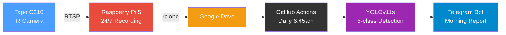
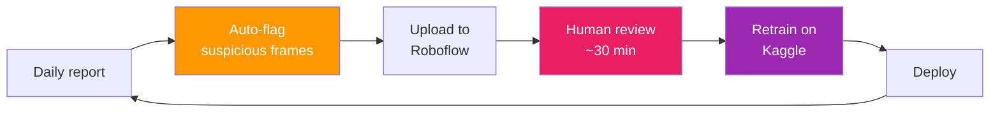
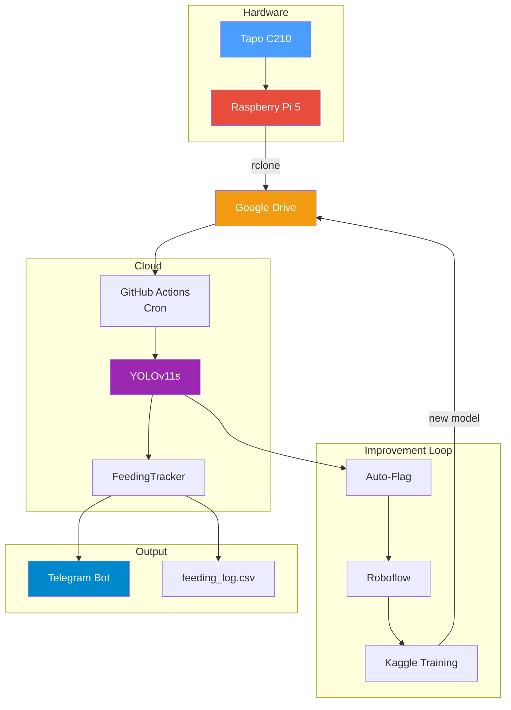

# Fair Feeder

**AI-powered cat feeding monitor** that tracks who eats what, counts kibble, detects hand-feeding, and sends daily Telegram reports — all from a $15 camera.

<!-- PHOTO: annotated video frame showing Dan at bowl with bounding boxes -->

---

## Why

I have two cats: **Dan** (picky eater) and **Sanbo** (food thief). Every morning I hand-feed Dan, but Sanbo steals his food the moment I look away. I needed to know: *did Dan actually eat enough today?*

## How It Works



1. **Pi 5** runs 24/7 — detects motion, records clips, uploads to Google Drive
2. **GitHub Actions** picks up clips every morning, runs YOLOv11 inference
3. **FeedingTracker** analyzes detections: who was at the bowl, how long, how many kibble eaten
4. **Telegram bot** sends the report with summary, timeline chart, and annotated video

## Detection Classes

| Class | What | Why |
|-------|------|-----|
| **Dan** | Tuxedo cat (dark) | Track feeding time |
| **Sanbo** | Calico cat (orange) | Detect food theft |
| **Dan_hand** | My hand near bowl | Track hand-feeding sessions |
| **Bowl** | Food bowl | Reference point for "at bowl" detection |
| **Kibble** | Individual food pieces | Count consumption |

## Sample Report

```
Fair Feeder Report
2026-03-28  ·  06:20:10 -> 06:22:02  ·  2m 30s

── Kibble ──
Start: ~26 kibble
Dan   ████████ 100%  (~24)
Sanbo ░░░░░░░░ 0%  (~0)
At bowl:  Dan 1m 46s  ·  Sanbo 0m 00s

── Verdict ──
Dan ate well — no compensation needed
```

<!-- PHOTO: timeline chart showing kibble count, cat presence over time -->

## Model Performance (V14)

Trained on 775 images with [Roboflow](https://roboflow.com) dataset management.

| Class | AP50 | Precision | Recall |
|-------|------|-----------|--------|
| Bowl | 0.995 | 0.990 | 1.000 |
| Dan | 0.936 | 0.867 | 0.897 |
| Dan_hand | 0.936 | 1.000 | 0.716 |
| Kibble | 0.931 | 0.949 | 0.872 |
| Sanbo | 0.985 | 0.899 | 1.000 |
| **Overall** | **0.957** | **0.941** | **0.897** |

## Data Flywheel

The model improves itself through automated feedback:



Auto-flagging catches: single-frame hallucinations, contradicting detections, impossible scenarios (hand without cat), kibble count jumps.

## Architecture



## Hardware

| Component | Cost | Role |
|-----------|------|------|
| Tapo C210 | ~$15 | IR camera, 2K, overhead mount |
| Raspberry Pi 5 | ~$60 | 24/7 motion recording + cat filter |
| Total | **~$75** | |

## Tech Stack

| Layer | Tool |
|-------|------|
| Detection | YOLOv11s (Ultralytics) |
| Training | Google Colab / Kaggle (free T4 GPU) |
| Dataset | Roboflow (ir-kibble) |
| OCR | EasyOCR |
| Motion recording | OpenCV MOG2 |
| Cat filter (Pi) | YOLOv8n (0.10 conf) |
| Secrets | Infisical |
| Notifications | Telegram Bot API |
| Storage | Google Drive (rclone) |
| Automation | GitHub Actions (cron) |

## Project Structure

```
fair-feeder/
├── morning_report.ipynb     # Daily CI pipeline (GitHub Actions)
├── smoketest.ipynb          # Interactive analysis (Colab)
├── batch_review.ipynb       # Historical video reprocessing
├── fair_feeder_v13.ipynb    # Model training notebook
├── flagging.py              # Auto-flag suspicious detections
├── roboflow_upload.py       # Upload flagged frames to Roboflow
├── motion_recorder.py       # Pi 5: 24/7 motion + cat filter
├── config.py                # Camera & detection settings
├── train.py                 # YOLOv11 training CLI
├── data.yaml                # YOLO dataset config (5 classes)
└── docs/
    └── blog/                # Blog post & presentation materials
```

## Setup

See [README_GIT_PULL.md](README_GIT_PULL.md) for credentials setup after cloning.
See [README_RPI_SERVICE.md](README_RPI_SERVICE.md) for Raspberry Pi 5 deployment.

## Blog Post

Read the full story: [How I Built an AI Cat Feeding Monitor](docs/blog/fair-feeder-story.md) (also available in [Traditional Chinese](docs/blog/fair-feeder-story-zh-tw.md))

## License

Private project. Not open-sourced.
