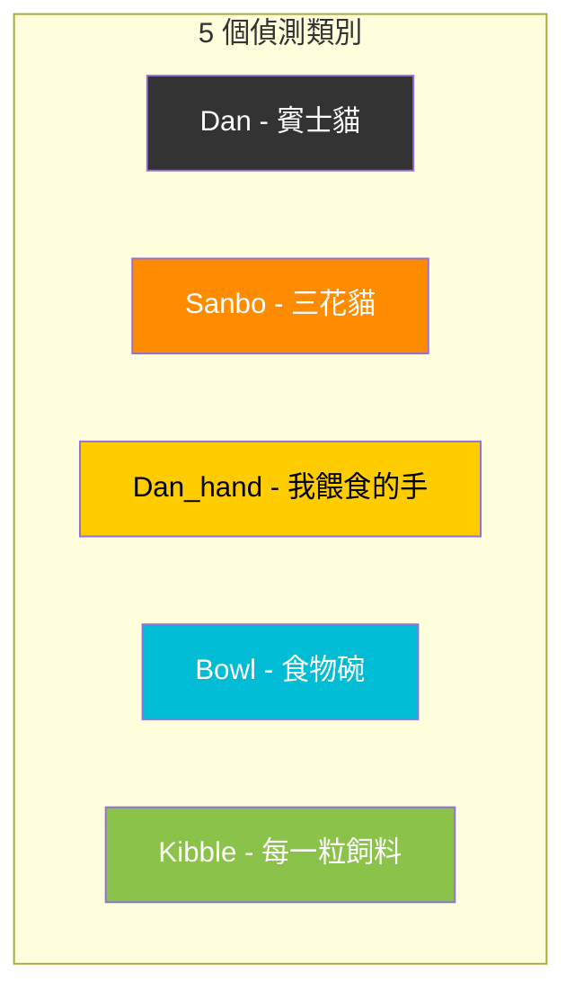
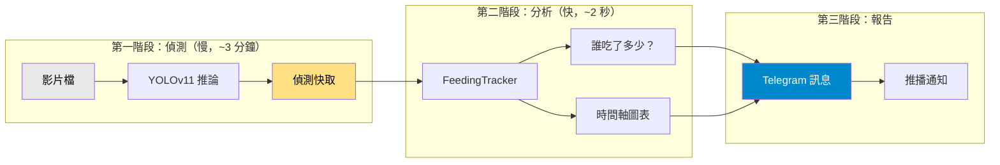
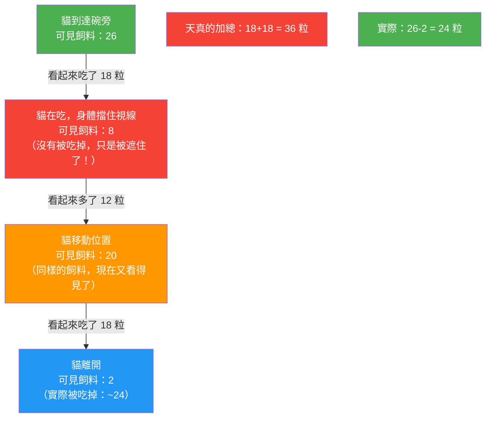
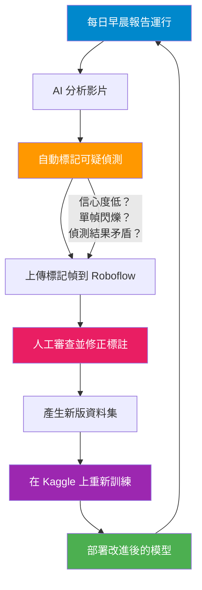
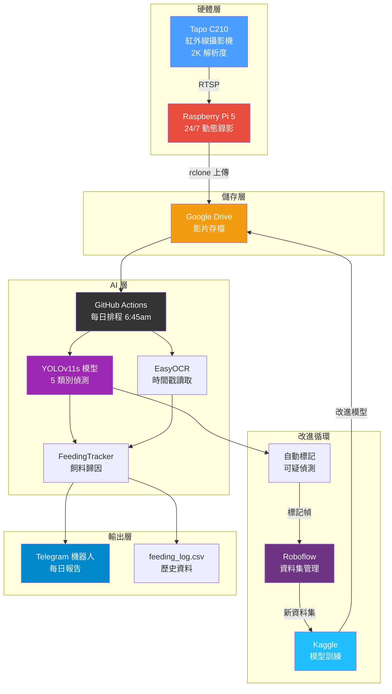
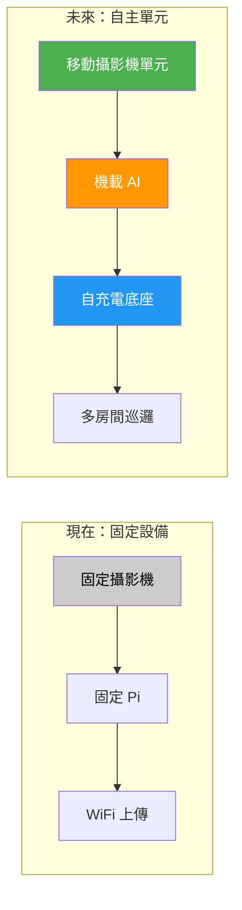

# Fair Feeder：我如何用一台 $15 的攝影機打造 AI 貓咪餵食監控系統

> *我有兩隻貓。一隻會偷吃另一隻的食物。所以我造了一套 AI 系統，精確追蹤誰吃了多少 —— 這件事教會我的機器學習知識，比任何課程都多。*

---

## 問題的起點

我養了兩隻貓：**Dan**（賓士貓，黑白色）和 **Sanbo**（三花貓，橘白色）。每天早上我會親手餵 Dan，因為他很挑食。但 Sanbo 是個......機會主義者。只要我一轉頭，Sanbo 就會衝過來吃 Dan 的食物。

困擾我的問題是：**Dan 今天到底有沒有吃夠？**

我不可能 24 小時盯著碗看。餵食時間是早上六點，我還半夢半醒。我需要一套系統幫我看著，然後精確告訴我發生了什麼事。

<!-- 照片：Dan 和 Sanbo 並排 —— 展示外觀差異（賓士貓 vs 三花貓）-->
<!-- 說明：Dan（左，賓士貓）和 Sanbo（右，三花貓）。Sanbo 看起來很無辜。他不是。-->

---

## 硬體設備：簡單又便宜

整套硬體成本不到 $80 美元：

| 設備 | 價格 | 用途 |
|------|------|------|
| Tapo C210 攝影機 | ~$15 | 紅外線夜視、2K 解析度、碗的俯視角度 |
| Raspberry Pi 5 | ~$60 | 24/7 動態偵測錄影 + 雲端上傳 |
| 貓碗 | 本來就有 | 戲劇上演的舞台 |

<!-- 照片：實際安裝 —— 攝影機架在碗上方，Pi 在旁邊 -->
<!-- 說明：Tapo C210 從上方直接俯拍餵食區域。Pi 5 放在旁邊，透過 WiFi 連線。-->

### 硬體連接方式

```mermaid
graph LR
    CAM[Tapo C210 攝影機]
    PI[Raspberry Pi 5]
    DRIVE[Google Drive]
    CLOUD[雲端 GPU - Colab/GitHub Actions]
    TG[Telegram 機器人]
    PHONE[我的手機]

    CAM -->|RTSP 影像串流| PI
    PI -->|動態影片片段| DRIVE
    DRIVE -->|影片檔案| CLOUD
    CLOUD -->|餵食報告 + 照片| TG
    TG -->|推播通知| PHONE

    style CAM fill:#4a9eff,color:#fff
    style PI fill:#e74c3c,color:#fff
    style DRIVE fill:#f39c12,color:#fff
    style CLOUD fill:#9b59b6,color:#fff
    style TG fill:#0088cc,color:#fff
    style PHONE fill:#27ae60,color:#fff
```



Pi 全天候運行。當它偵測到碗附近有動靜時，會錄下影片片段並上傳到 Google Drive。每天早上 6:45，雲端伺服器會拿到這些片段、跑 AI 分析，然後在我起床前就把 Telegram 報告推送給我。

<!-- 照片：手機上的 Telegram 報告截圖 -->
<!-- 說明：早晨報告透過 Telegram 送達，包含餵食摘要、時間軸圖表和標註影片。-->

---

## AI 模型：教電腦數飼料

### 模型偵測的目標

我訓練了一個 YOLOv11 物件偵測模型，能辨識 5 種東西：



模型處理影片的每一幀，在它辨識到的東西周圍畫方框。由此，系統能推算出：

- **誰在碗旁邊**（Dan、Sanbo、還是兩隻都在）
- **每隻貓吃了多久**
- **碗裡有多少粒飼料**（以及數量如何隨時間變化）
- **我有沒有親手餵 Dan**（偵測到我的手靠近碗）

<!-- 照片：標註影片中的一幀，顯示 Dan、碗和飼料的方框 -->
<!-- 說明：AI 在它辨識到的每個目標周圍畫方框。這裡偵測到 Dan 在碗旁邊，有 12 粒飼料可見。-->

### 分析流程



關鍵設計：**第一階段很慢**（每一幀都要跑 AI 需要好幾分鐘），但結果會被快取。第二階段是即時的 —— 我可以用不同參數在 2 秒內重跑分析，不需要重新處理影片。這讓我可以快速調整判斷閾值。

---

## 什麼行得通（什麼完全行不通）

打造這套系統不是一帆風順的。以下是真實的版本。

### 嘗試 1：現成模型（失敗）

我一開始試著在 Pi 上用現成的物件偵測模型（EfficientDet）。攝影機是從正上方俯拍碗的。在這個極端角度下，模型產生了幻覺 —— 它看到「烤箱」和「水槽」，而不是貓。

**教訓：** 通用模型無法處理非標準的攝影機角度。你需要自己訓練模型。

### 嘗試 2：在 Google Colab 上訓練（成功！）

我從攝影機的角度拍攝貓的照片，在 Roboflow（一個資料集管理工具）上標註，然後在 Google Colab 的免費 GPU 上訓練 YOLOv11 模型。

第一版模型......還行。它能找到貓，但在以下方面掙扎：
- **飼料**（很小，在紅外線照明下更難看見）
- **Sanbo 幻覺**（模型在 Sanbo 不在場時「想像」出他）
- **Dan 的手**（在我其實沒有在餵食時出現誤判）

### 嘗試 3：Raspberry Pi 的挑戰（部分成功）

在 Pi 5 上跑完整的 YOLOv11 模型太慢了 —— 每一幀要好幾秒。所以我把工作拆開：

- **Pi 負責：** 動態偵測 + 輕量貓咪過濾器（YOLOv8n，一個很小的模型）
- **雲端負責：** 在錄好的片段上跑完整的 YOLOv11 分析

這個架構發揮了每台設備的長處。Pi 很擅長「有東西在動嗎？」但不擅長「發生了什麼事？」。雲端 GPU 很擅長深度分析但不能 24/7 運行。

<!-- 照片：接好線的 Raspberry Pi 5 -->
<!-- 說明：全天候運行的 Pi 5。它錄下動態片段並自動上傳到 Google Drive。-->

### 計數問題（持續中的戰鬥）

計算飼料數量是最困難的部分。挑戰包括：

1. **遮擋**：貓在吃東西時，身體會擋住攝影機的視線。計數下降了 —— 但飼料並沒有被吃掉，只是被遮住了。
2. **閃爍**：同一粒飼料在相鄰幀之間被偵測到/偵測不到。
3. **紅外線照明**：在紅外線（夜視）下，飼料看起來跟白天不一樣。

我用滾動中位數濾波器解決了閃爍問題（平滑單幀的雜訊）。對於遮擋問題，我使用**峰值可見數量** —— 攝影機能同時看到最多飼料的那個時刻 —— 作為碗裡實際有多少飼料的最佳估計。



---

## 資料飛輪：系統如何自我改進

這是我最驕傲的部分。與其手動尋找錯誤然後修復，我建立了一個**自我改進的循環**：



### 自動標記的運作方式

系統會自動識別 AI 可能判斷錯誤的幀：

| 標記類型 | 捕捉什麼 | 範例 |
|----------|----------|------|
| `blip-sanbo` | Sanbo 只出現 1-2 幀然後消失 | 幻覺 —— Sanbo 其實不在那裡 |
| `no-codetect-dan_hand` | 偵測到手但沒有 Dan 的身體 | 誤判 —— 不在場的貓不可能被餵食 |
| `conflict-dan-sanbo` | 兩隻貓被偵測在同一個位置 | 模型搞混了是哪隻貓 |
| `kibble-jump` | 飼料計數在一幀內變化超過 15 | 出了問題 —— 飼料不會瞬間出現/消失 |

這些被標記的幀會自動上傳到 Roboflow，並帶有模型預測的標註。我只需要打開 Roboflow，修正錯誤（大約 30 分鐘），然後重新訓練。

### 成果：V13 vs V14

經過一個資料飛輪循環（231 張標記幀被審查和修正）：

| 指標 | V13（之前）| V14（之後）| 變化 |
|------|-----------|-----------|------|
| Sanbo 偵測 | 88% 召回率 | **100% 召回率** | 不再遺漏 Sanbo |
| Sanbo 幻覺 | 19 部影片中有 18 部 | **首次測試為 0** | 最大的勝利 |
| Dan_hand 誤判 | 每部影片 8-20 次 | **0 次誤判** | 完美精準度 |
| 整體準確度 (mAP50) | 0.956 | **0.957** | 略有提升 |

光是 Sanbo 幻覺的修復，就讓每日報告的可信度大幅提高。

<!-- 照片：V13 vs V14 的 Telegram 報告對比 -->
<!-- 說明：左：V13 報告有「Sanbo 閃爍」誤報。右：V14 報告 —— 乾淨，沒有幻覺。-->

---

## 日常體驗

每天早上大約七點，我會收到 Telegram 通知：

```
Fair Feeder Report
2026-03-28  ·  06:20:10 -> 06:22:02  ·  2m 30s

── 飼料 ──
開始：~26 粒飼料
Dan   ████████ 100%  (~24)
Sanbo ░░░░░░░░ 0%  (~0)
在碗旁：Dan 1m 46s  ·  Sanbo 0m 00s

── 結論 ──
Dan 吃得很好 —— 不需要補餵
```

我立刻就知道：Dan 吃了，Sanbo 沒有偷吃，不需要任何動作。如果 Dan 吃得不夠，我會確切知道需要手工補餵多少粒飼料。

<!-- 照片：Telegram 中的偵測時間軸圖表 -->
<!-- 說明：時間軸圖表顯示飼料計數（黃色）、Dan 在碗旁（青色）、Sanbo 在碗旁（橘色）和手工餵食（藍色）隨時間的變化。-->

---

## 系統架構總覽



---

## 下一步：自主移動監控器

目前的系統能用，但固定在一個位置。我的下一個目標：**可移動、自充電的監控單元**。



願景：
- **移動平台**，可以在房間之間移動來跟蹤貓咪
- **機載 AI**，強大到足以在本地運行偵測（不依賴雲端）
- **自充電底座**，永遠不會沒電
- **多貓、多碗**，監控整個家

我到目前為止建造的一切 —— 偵測模型、餵食追蹤器、資料飛輪 —— 都可以直接轉移到移動平台上。模型不在乎攝影機是固定的還是移動的；它只需要看到碗就好。

<!-- 照片：移動單元的草圖或概念圖（如果有的話）-->
<!-- 說明：自主餵食監控器的早期概念 —— 一個在餵食站之間巡邏並自動回充的移動單元。-->

---

## 關鍵收穫

1. **從最便宜的硬體開始。** 一台 $15 的攝影機和免費 GPU 讓我達到 95%+ 的準確率。在確認方法可行之前，不要過度投資。

2. **按設備優勢分工。** Pi 偵測動態（便宜、24/7）。雲端跑 AI（強大、按需）。兩者都無法勝任對方的工作。

3. **建立資料飛輪，而不是一次性模型。** 自動標記系統意味著模型每週都在進步，只需要最少的人工。V14 已經比 V13 好了，V15 還會更好。

4. **解決自己的問題。** 最好的專案來自真正的困擾。我不是為了學 YOLO 或 Roboflow 才開始的 —— 我只是想知道 Dan 有沒有吃飽。

5. **快速迭代，不求完美。** 我修了 37+ 個 bug，做了 50+ 個決策，訓練了多個模型版本。每次迭代都讓系統好一點。沒有一次需要做到完美。

---

## 技術堆疊（給好奇的人）

| 組件 | 工具 | 為什麼 |
|------|------|--------|
| 物件偵測 | YOLOv11s (Ultralytics) | 5 類別偵測的最佳準確度/速度平衡 |
| 訓練 | Google Colab / Kaggle (免費 T4 GPU) | 零成本 |
| 資料集管理 | Roboflow | 標註 UI + 版本控制 + 匯出 |
| 時間戳讀取 | EasyOCR | 讀取攝影機內建的時間戳 |
| 動態錄影 | OpenCV (MOG2) | 輕量，能在 Pi 5 上跑 |
| 金鑰管理 | Infisical | API 金鑰安全儲存 |
| 通知 | Telegram Bot API | 照片 + 影片 + 文字一則訊息搞定 |
| 儲存 | Google Drive (rclone) | 免費，從 Pi 自動同步 |
| 自動化 | GitHub Actions (排程) | 每日早晨報告自動執行，零維護 |
| 模型改進 | 自定義自動標記 + Roboflow | 自我改進的資料飛輪 |

---

*用好奇心、咖啡因和兩隻非常有主見的貓打造。*

<!-- 照片：Dan 和 Sanbo 放鬆的合照 —— 「大團圓」照片 -->
<!-- 說明：Dan 和 Sanbo，吃飽喝足，受到 AI 監控。Dan 不知道 AI 的存在。Sanbo 不在乎。-->
