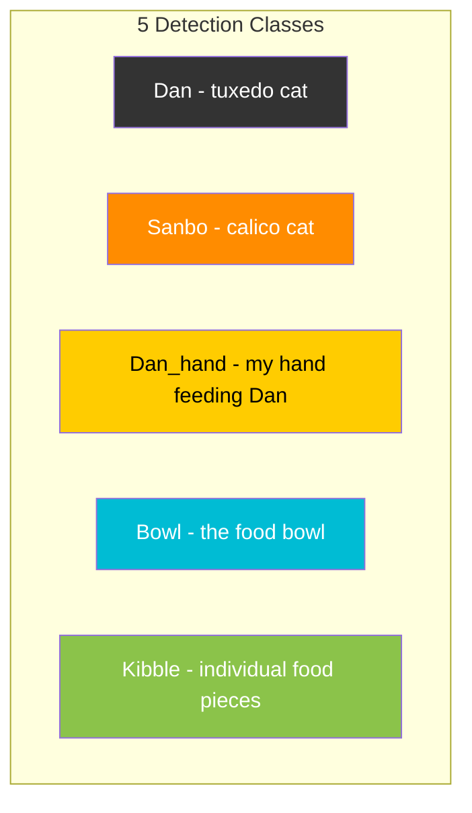
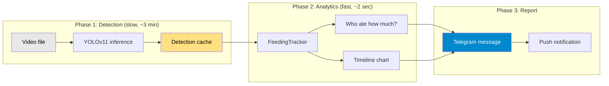
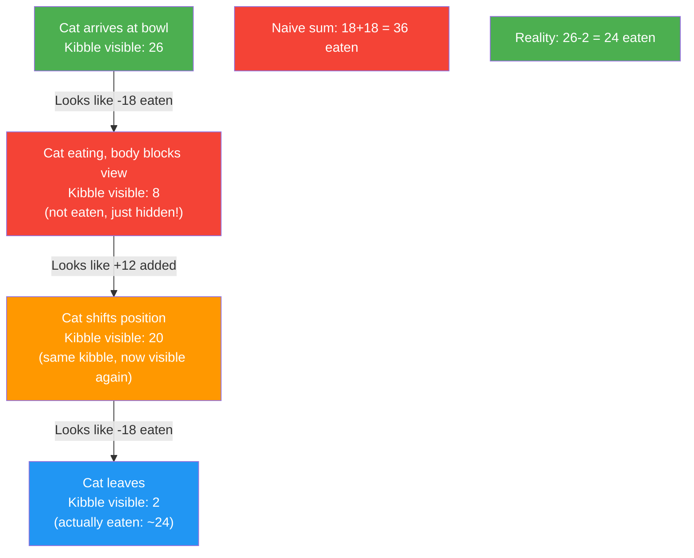
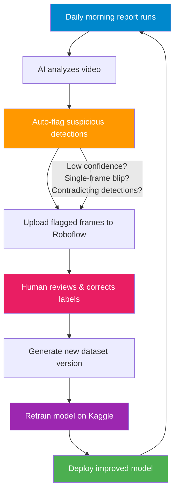
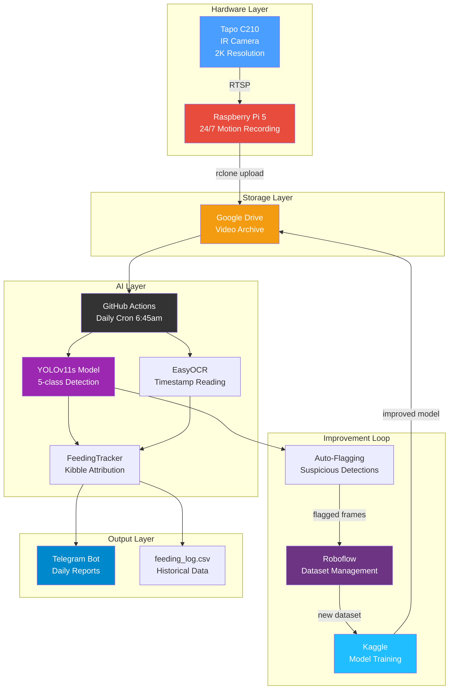
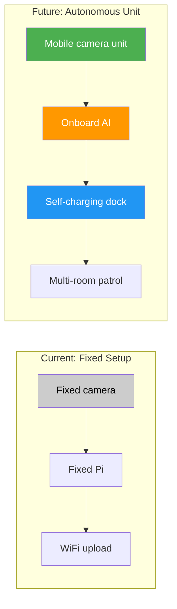

# Fair Feeder: How I Built an AI Cat Feeding Monitor with a $15 Camera

> *I have two cats. One steals the other's food. So I built an AI system to find out exactly who eats what — and it taught me more about machine learning than any course ever did.*

---

## The Problem

I have two cats: **Dan** (a tuxedo) and **Sanbo** (a calico). Every morning, I hand-feed Dan because he's a picky eater. But Sanbo is... an opportunist. The moment I look away, Sanbo swoops in and eats Dan's food.

The question that haunted me: **Did Dan actually eat enough today?**

I couldn't watch the bowl 24/7. The feeding happens at 6am. I'm half-asleep. I needed a system that could watch for me and tell me exactly what happened.

<!-- PHOTO: Dan and Sanbo side by side — show the visual difference (tuxedo vs calico) -->
<!-- Caption: Dan (left, tuxedo) and Sanbo (right, calico). Sanbo looks innocent. He is not. -->

---

## The Hardware: Simple and Cheap

The entire hardware setup costs under $80:

| Component | Cost | Purpose |
|-----------|------|---------|
| Tapo C210 camera | ~$15 | IR night vision, 2K resolution, overhead view of the bowl |
| Raspberry Pi 5 | ~$60 | 24/7 motion recording + cloud upload |
| Cat bowl | Already had it | The stage where the drama unfolds |

<!-- PHOTO: The physical setup — camera mounted above the bowl, Pi nearby -->
<!-- Caption: The Tapo C210 mounted overhead, pointing straight down at the feeding area. The Pi 5 sits nearby, connected to WiFi. -->

### How the hardware connects

```mermaid
graph LR
    CAM[Tapo C210 Camera]
    PI[Raspberry Pi 5]
    DRIVE[Google Drive]
    CLOUD[Cloud GPU - Colab/GitHub Actions]
    TG[Telegram Bot]
    PHONE[My Phone]

    CAM -->|RTSP video stream| PI
    PI -->|motion clips| DRIVE
    DRIVE -->|video files| CLOUD
    CLOUD -->|feeding report + photos| TG
    TG -->|push notification| PHONE

    style CAM fill:#4a9eff,color:#fff
    style PI fill:#e74c3c,color:#fff
    style DRIVE fill:#f39c12,color:#fff
    style CLOUD fill:#9b59b6,color:#fff
    style TG fill:#0088cc,color:#fff
    style PHONE fill:#27ae60,color:#fff
```



The Pi runs 24/7. When it detects motion near the bowl, it records a video clip and uploads it to Google Drive. Every morning at 6:45am, a cloud server picks up the clips, runs AI analysis, and sends me a Telegram report before I even wake up.

<!-- PHOTO: Screenshot of a Telegram report on phone -->
<!-- Caption: The morning report arrives on Telegram with a feeding summary, timeline chart, and annotated video. -->

---

## The AI: Teaching a Computer to Count Kibble

### What the model detects

I trained a YOLOv11 object detection model to recognize 5 things:



The model processes every frame of the video and draws bounding boxes around what it sees. From this, the system figures out:

- **Who is at the bowl** (Dan, Sanbo, or both)
- **How long** each cat spends eating
- **How many kibble** are in the bowl (and how the count changes over time)
- **Whether I hand-fed Dan** (detects my hand near the bowl)

<!-- PHOTO: A frame from the annotated video showing bounding boxes around Dan, the bowl, and kibble -->
<!-- Caption: The AI draws boxes around everything it recognizes. Here it detects Dan at the bowl with 12 kibble visible. -->

### The analysis pipeline



The key insight: **Phase 1 is slow** (running AI on every frame takes minutes), but the results are cached. Phase 2 is instant — I can re-run the analytics with different settings in 2 seconds without re-processing the video. This lets me tune thresholds quickly.

---

## What Worked (and What Definitely Didn't)

Building this was not a straight line. Here's the honest version.

### Attempt 1: Pre-trained models (Failed)

I first tried using off-the-shelf object detection models (EfficientDet) on the Pi. The camera is mounted overhead, looking straight down at the bowl. At this extreme angle, the model hallucinated — it saw "ovens" and "sinks" instead of cats.

**Lesson:** General-purpose models don't work for unusual camera angles. You need a custom-trained model.

### Attempt 2: Training on Google Colab (Worked!)

I photographed the cats from the camera's perspective, labeled the images in Roboflow (a dataset management tool), and trained a YOLOv11 model on Google Colab's free GPU.

The first model was... okay. It could find the cats, but it struggled with:
- **Kibble** (tiny, hard to see under IR lighting)
- **Sanbo hallucinations** (the model "imagined" Sanbo in frames where he wasn't there)
- **Dan's hand** (false positives when my hand wasn't actually feeding)

### Attempt 3: The Raspberry Pi challenge (Partially worked)

Running the full YOLOv11 model on the Pi 5 was too slow — each frame took seconds. So I split the work:

- **Pi does:** Motion detection + lightweight cat filter (YOLOv8n, a tiny model)
- **Cloud does:** Full YOLOv11 analysis on the recorded clips

This architecture plays to each device's strengths. The Pi is great at "is something moving?" but terrible at "what's happening?". The cloud GPU is great at deep analysis but can't run 24/7.

<!-- PHOTO: Raspberry Pi 5 with cables connected -->
<!-- Caption: The Pi 5 running 24/7. It records motion clips and uploads them to Google Drive automatically. -->

### The counting problem (Ongoing battle)

Counting kibble turned out to be the hardest part. The challenges:

1. **Occlusion**: When a cat is eating, their body blocks the camera's view of the kibble. The count drops — but the kibble wasn't eaten, just hidden.
2. **Flickering**: The same kibble gets detected/undetected between frames as the cat moves slightly.
3. **IR lighting**: Under infrared (night vision), kibble looks different than in daylight.

I solved flickering with a rolling median filter (smooth out single-frame glitches). For occlusion, I use the **peak visible count** — the moment when the camera can see the most kibble at once — as the best estimate of how many kibble were really in the bowl.



---

## The Data Flywheel: How the System Improves Itself

This is the part I'm most proud of. Instead of manually finding mistakes and fixing them, I built a **self-improving loop**:



### How auto-flagging works

The system automatically identifies frames where the AI is probably wrong:

| Flag type | What it catches | Example |
|-----------|----------------|---------|
| `blip-sanbo` | Sanbo detected for just 1-2 frames then gone | Hallucination — Sanbo wasn't there |
| `no-codetect-dan_hand` | Hand detected without Dan's body | False positive — can't feed a cat that isn't there |
| `conflict-dan-sanbo` | Both cats detected in the same spot | Model confused about which cat it's looking at |
| `kibble-jump` | Kibble count changes by 15+ in one frame | Something is wrong — kibble don't appear/disappear instantly |

These flagged frames are automatically uploaded to Roboflow with the model's predicted labels visible. I just need to open Roboflow, correct the mistakes (takes ~30 minutes), and retrain.

### Results: V13 vs V14

After one cycle of the data flywheel (231 flagged frames reviewed and corrected):

| Metric | V13 (before) | V14 (after) | Change |
|--------|-------------|-------------|--------|
| Sanbo detection | 88% recall | **100% recall** | No more missed Sanbo |
| Sanbo hallucinations | 18/19 videos affected | **0 in first test** | Biggest win |
| Dan_hand false positives | 8-20 per video | **0 false positives** | Perfect precision |
| Overall accuracy (mAP50) | 0.956 | **0.957** | Slightly better |

The Sanbo hallucination fix alone made the daily reports dramatically more trustworthy.

<!-- PHOTO: Side-by-side Telegram reports from V13 vs V14 -->
<!-- Caption: Left: V13 report with "Sanbo blip" false alarms. Right: V14 report — clean, no hallucinations. -->

---

## The Daily Experience

Every morning around 7am, I get a Telegram notification:

```
Fair Feeder Report
2026-03-28  ·  06:20:10 -> 06:22:02  ·  2m 30s

── Kibble ──
Start: ~26 kibble
Dan   ████████ 100%  (~24)
Sanbo ░░░░░░░░ 0%  (~0)
At bowl:  Dan 1m 46s  ·  Sanbo 0m 00s

── Verdict ──
Dan ate well — no compensation needed
```

I know immediately: Dan ate, Sanbo didn't steal anything, no action needed. If Dan didn't eat enough, I know exactly how many kibble to hand-feed him to compensate.

<!-- PHOTO: The detection timeline chart from Telegram -->
<!-- Caption: The timeline chart shows kibble count (yellow), Dan at bowl (teal), Sanbo at bowl (orange), and hand-feeding (blue) over time. -->

---

## Architecture Overview



---

## What's Next: The Autonomous Monitor

The current system works, but it's fixed in one location. My next goal: **a movable, self-charging monitoring unit**.



The vision:
- **Mobile platform** that can move between rooms to follow the cats
- **Onboard AI** powerful enough to run detection locally (no cloud dependency)
- **Self-charging dock** so it never runs out of battery
- **Multi-cat, multi-bowl** monitoring across the entire home

Everything I've built so far — the detection model, the feeding tracker, the data flywheel — transfers directly to the mobile platform. The model doesn't care if the camera is fixed or moving; it just needs a view of the bowl.

<!-- PHOTO: Sketch or concept drawing of the mobile unit (if available) -->
<!-- Caption: Early concept for the autonomous feeding monitor — a mobile unit that patrols feeding stations and returns to charge. -->

---

## Key Takeaways

1. **Start with the cheapest hardware.** A $15 camera and a free GPU got me 95%+ accuracy. Don't over-invest before you know the approach works.

2. **Split work by device strengths.** The Pi detects motion (cheap, 24/7). The cloud runs AI (powerful, on-demand). Neither could do the other's job well.

3. **Build a data flywheel, not a one-shot model.** The auto-flagging system means the model improves every week with minimal effort. V14 is already better than V13, and V15 will be better still.

4. **Solve your own problems.** The best projects come from genuine frustration. I didn't set out to learn YOLO or Roboflow — I just wanted to know if Dan ate enough.

5. **Iterate fast, not perfectly.** I've fixed 37+ bugs, made 50+ decisions, and trained multiple model versions. Each iteration makes the system a little better. None of them needed to be perfect.

---

## Tech Stack (for the curious)

| Component | Tool | Why |
|-----------|------|-----|
| Object detection | YOLOv11s (Ultralytics) | Best accuracy/speed for 5-class detection |
| Training | Google Colab / Kaggle (free T4 GPU) | Zero cost |
| Dataset management | Roboflow | Labeling UI + versioning + export |
| Timestamp reading | EasyOCR | Reads camera's burned-in timestamp |
| Motion recording | OpenCV (MOG2) | Lightweight, runs on Pi 5 |
| Secret management | Infisical | API keys stored securely |
| Notifications | Telegram Bot API | Photos + video + text in one message |
| Storage | Google Drive (rclone) | Free, syncs from Pi automatically |
| Automation | GitHub Actions (cron) | Morning report runs daily, zero maintenance |
| Model improvement | Custom auto-flagging + Roboflow | Self-improving data flywheel |

---

*Built with curiosity, caffeine, and two very opinionated cats.*

<!-- PHOTO: Dan and Sanbo together, relaxed — the "happy ending" shot -->
<!-- Caption: Dan and Sanbo, well-fed and monitored. Dan doesn't know about the AI. Sanbo doesn't care. -->
